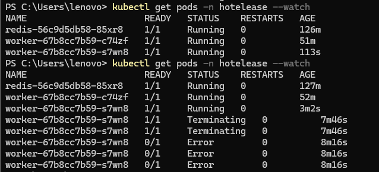
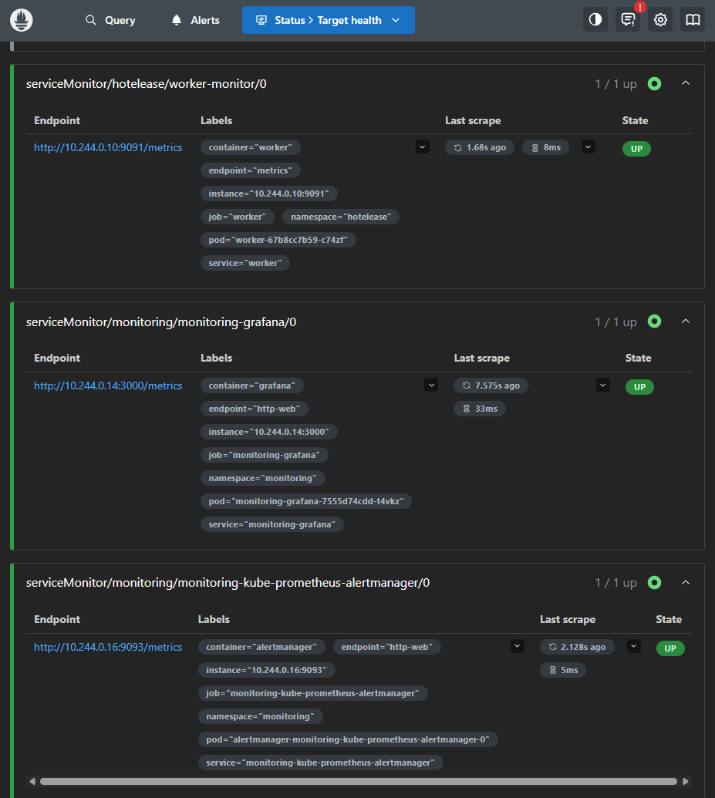

## Phase 7 — Task Queue, Background Worker, Process Management & Autoscaling (Capstone)

Building on the Kubernetes deployment above, this phase adds asynchronous background job processing to the app — decoupling slow, non-critical work (sending emails) from the main API request/response cycle, and demonstrating horizontal scaling driven by real application load rather than just CPU.

### Why

The original booking-cancellation flow sent confirmation emails inline, "fire and forget," inside the same request that handled the cancellation. This worked, but had no reliability guarantees: if the server restarted at the wrong moment, an email could be silently lost with no retry and no record it was ever supposed to be sent. Moving this into a task queue adds persistence (jobs survive a crash), a foundation for retries, and — most importantly for this capstone — the ability to scale the workers that process these jobs independently of the main API.

### Architecture

```
                     API request (cancel booking)
                              │
                              ▼
                    ┌──────────────────┐
                    │  backend (API)   │
                    │  BookingService  │
                    └────────┬─────────┘
                             │  emailQueue.add(...)
                             ▼
                    ┌──────────────────┐
                    │  Redis (Queue)   │
                    │  BullMQ backend  │
                    └────────┬─────────┘
                             │  worker pulls jobs
                             ▼
                    ┌──────────────────┐
                    │  worker pod(s)   │
                    │  worker.js       │───▶ MongoDB (booking/user lookup)
                    │  /metrics (9091) │───▶ Email service (send confirmation)
                    └────────┬─────────┘
                             │  scraped by
                             ▼
                    ┌──────────────────┐
                    │   Prometheus     │
                    └────────┬─────────┘
                             │  worker_jobs_processed_total
                             ▼
                    ┌──────────────────┐
                    │ Prometheus Adapter│
                    └────────┬─────────┘
                             │  custom metric
                             ▼
                    ┌──────────────────┐
                    │  HPA (worker)    │  scales worker Deployment 1 → 5 replicas
                    └──────────────────┘
```

### What's been built

**Task queue (Redis + BullMQ)**
- Redis deployed both locally (Docker, for early development) and as a Kubernetes Deployment/Service inside the `hotelease` namespace
- `queue.js` defines an `email-confirmation` BullMQ queue, with the Redis connection host/port configurable via environment variables (`REDIS_HOST`/`REDIS_PORT`) so the same code works identically whether running locally (`localhost`) or inside the cluster (`redis` — resolved via Kubernetes' internal DNS)
- `BookingService.js`'s cancellation flow was refactored: instead of sending the confirmation email inline, it now pushes a job onto the queue and returns immediately

**Background worker**
- `worker.js` — a standalone Node.js process, separate from the main Express API, that listens to the queue and processes `cancellation-email` jobs: looks up the booking/user in MongoDB, builds the email, and sends it
- Runs as its own Docker image (`Dockerfile.worker`), sharing the same codebase/dependencies as the backend but with a different entrypoint

**Process management (PM2)**
- The worker is managed by PM2 locally, giving it automatic restarts on crash and background execution without needing a dedicated terminal — demonstrating process-level resilience as a complement to Kubernetes' pod-level resilience

**Kubernetes deployment**
- `redis-deployment.yml` / `redis-service.yml` — Redis running as a first-class citizen of the cluster
- `worker-deployment.yml` / `worker-service.yml` — the worker running as its own Deployment, connected to MongoDB Atlas, Redis, and email credentials via the existing `backend-secret`
- Debugging note: connecting to Redis via `localhost` works when running the worker directly on a machine, but fails inside a container (`ECONNREFUSED`) since `localhost` inside a pod refers to the pod itself. Fixed by making the Redis host configurable and pointing it at the `redis` Service's DNS name inside the cluster.

**Monitoring**
- Installed the `kube-prometheus-stack` (Prometheus + Grafana + Alertmanager) via Helm into a dedicated `monitoring` namespace
- Added `prom-client` to the worker, exposing a `worker_jobs_processed_total` counter (labeled by `completed`/`failed`) on a dedicated `/metrics` endpoint (port 9091), following the same pattern as the backend's existing metrics setup
- Created a `ServiceMonitor` (`worker-servicemonitor.yml`) so Prometheus automatically discovers and scrapes the worker
- Debugging note: a `ServiceMonitor`'s `selector` matches based on the target *Service's* labels, not the Service's pod-`selector` — the worker's Service initially had no labels of its own, so Prometheus couldn't find it despite scrapes technically being configured correctly. Fixed by adding `labels: app: worker` to the Service's metadata.

**Custom-metric autoscaling**
- Installed the Prometheus Adapter via Helm, extending the existing `adapter-values.yml` to also expose `worker_jobs_processed_total` as a Kubernetes custom metric (alongside the backend's existing `http_requests_total`)
- Created `hpa-worker-custom.yml` — an HPA scaling the worker Deployment (1 → 5 replicas) based on the rate of jobs being processed
- Verified end-to-end: wrote a small load-testing script (`flood-queue.js`) that pushes a burst of jobs directly onto the queue; watched the HPA react in real time, scaling the worker from 1 to 2 replicas as the processing rate climbed, then automatically scale back down to 1 once the queue drained and the cooldown window passed


*Worker Deployment scaling from 1 to 2 replicas in response to the custom `worker_jobs_processed_total` metric, then settling back to 1 as the queue drains.*


*Prometheus successfully scraping the worker's `/metrics` endpoint via the ServiceMonitor.*

### Project structure additions

```
HotelEase-k8s/
├── backend/
│   ├── queue.js                    (BullMQ queue definition, Redis connection)
│   ├── worker.js                   (standalone background worker + /metrics endpoint)
│   ├── flood-queue.js              (load-testing script for the scaling demo)
│   └── Dockerfile.worker           (separate image for the worker process)
├── k8s/
│   ├── redis-deployment.yml
│   ├── redis-service.yml
│   ├── worker-deployment.yml
│   ├── worker-service.yml
│   ├── worker-servicemonitor.yml
│   └── hpa-worker-custom.yml
```

### Run locally (in addition to the setup above)

```bash
# Redis + worker manifests
kubectl apply -f k8s/redis-deployment.yml
kubectl apply -f k8s/redis-service.yml

# build + load the worker image
docker build -f backend/Dockerfile.worker -t hotelease-worker:latest ./backend
kind load docker-image hotelease-worker:latest --name hotelease

kubectl apply -f k8s/worker-deployment.yml
kubectl apply -f k8s/worker-service.yml

# monitoring stack (Prometheus + Grafana)
helm repo add prometheus-community https://prometheus-community.github.io/helm-charts
helm repo update
kubectl create namespace monitoring
helm install monitoring prometheus-community/kube-prometheus-stack --namespace monitoring

kubectl apply -f k8s/worker-servicemonitor.yml

# Prometheus Adapter (exposes custom metrics to Kubernetes)
helm install prometheus-adapter prometheus-community/prometheus-adapter -n monitoring -f k8s/adapter-values.yml

# worker autoscaling
kubectl apply -f k8s/hpa-worker-custom.yml
```

### What this demonstrates

- Decoupling slow/unreliable work (email sending) from the main request/response cycle using a persistent task queue
- Running a background worker as an independent, containerized process alongside a main API — same codebase, different entrypoint, deployed and scaled separately
- Resilience at two layers: PM2 for process-level auto-restart, Kubernetes for pod-level auto-restart and replica management
- Custom application metrics (not just CPU/memory) driving real autoscaling decisions — the same pattern used in production systems processing background jobs at scale (emails, image processing, video encoding, etc.)
